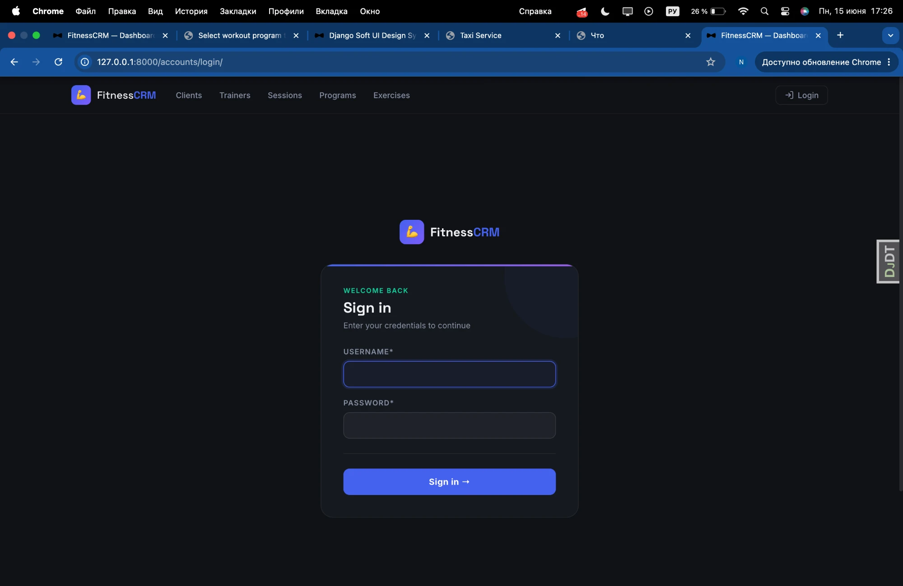
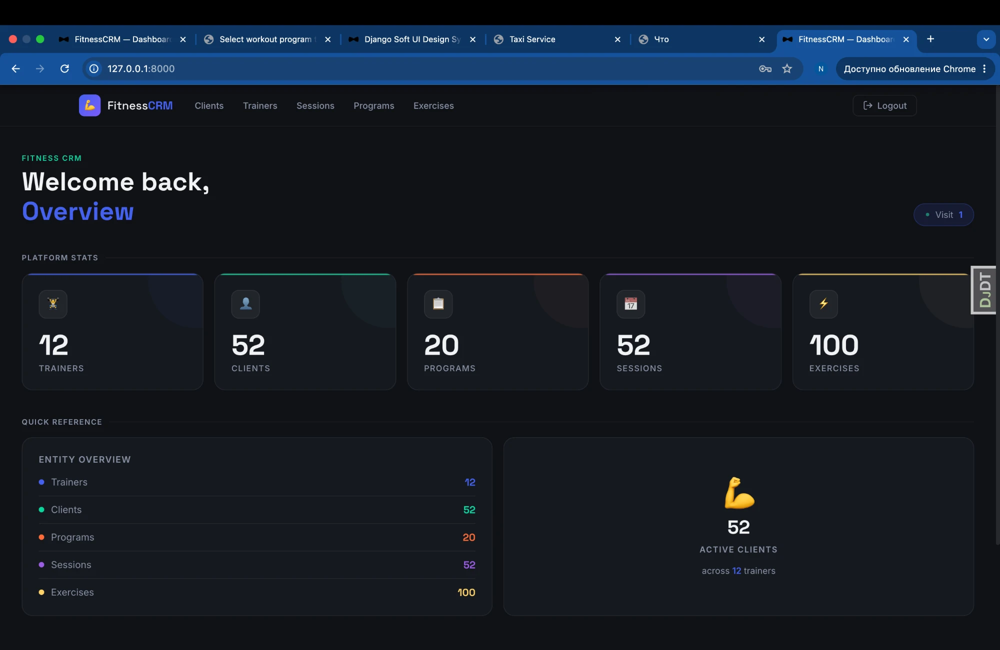
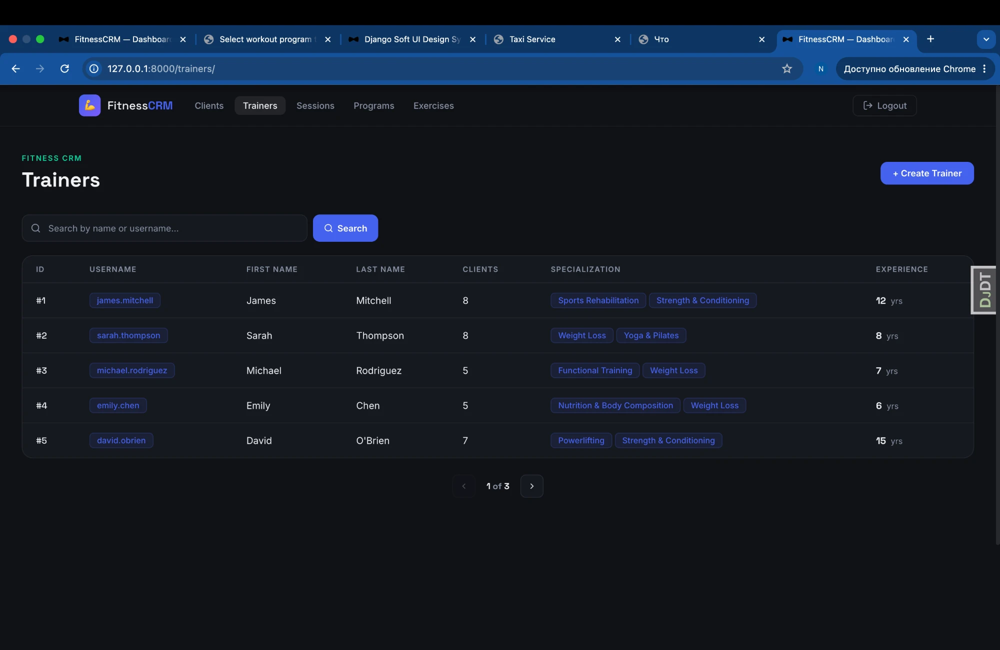
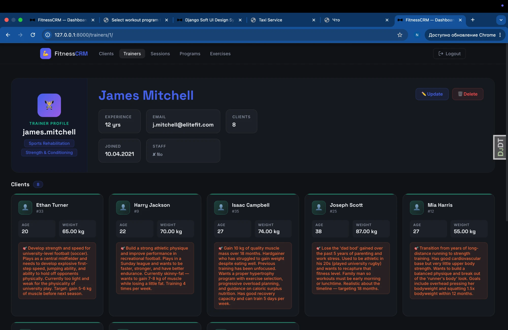
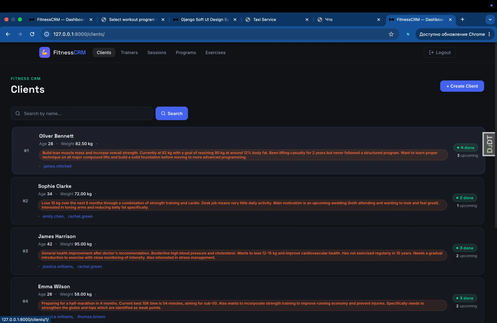
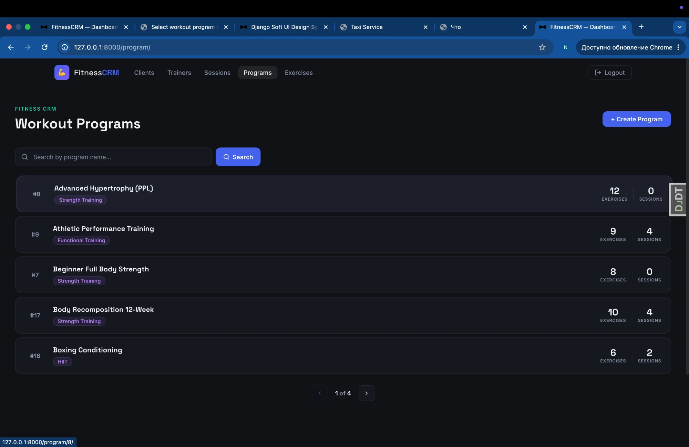
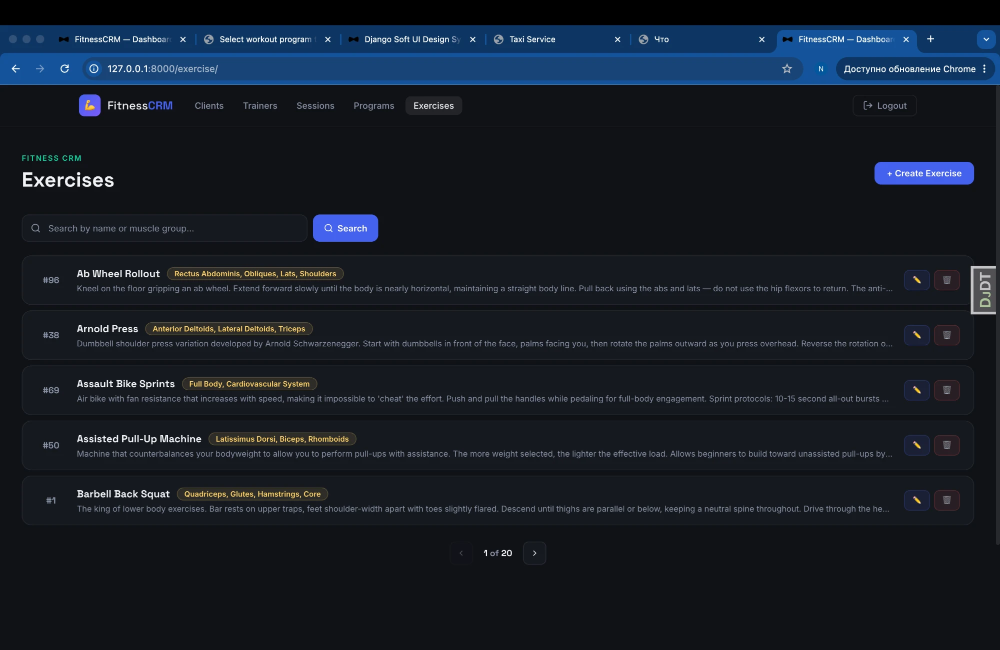
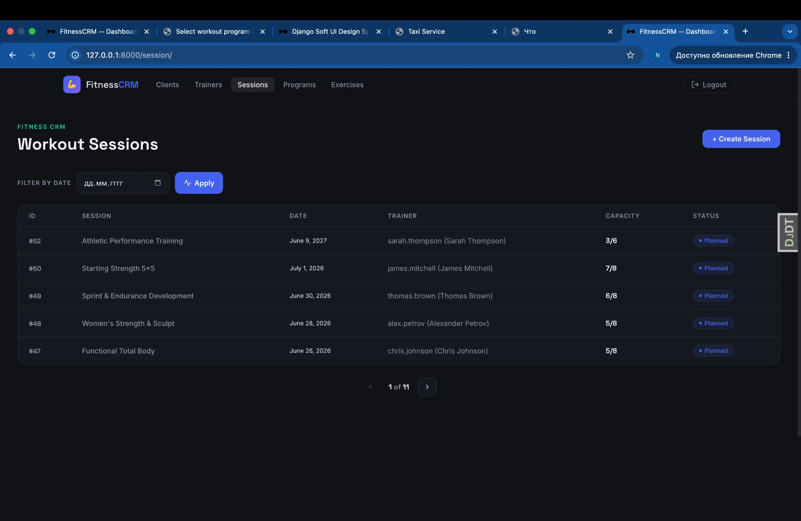
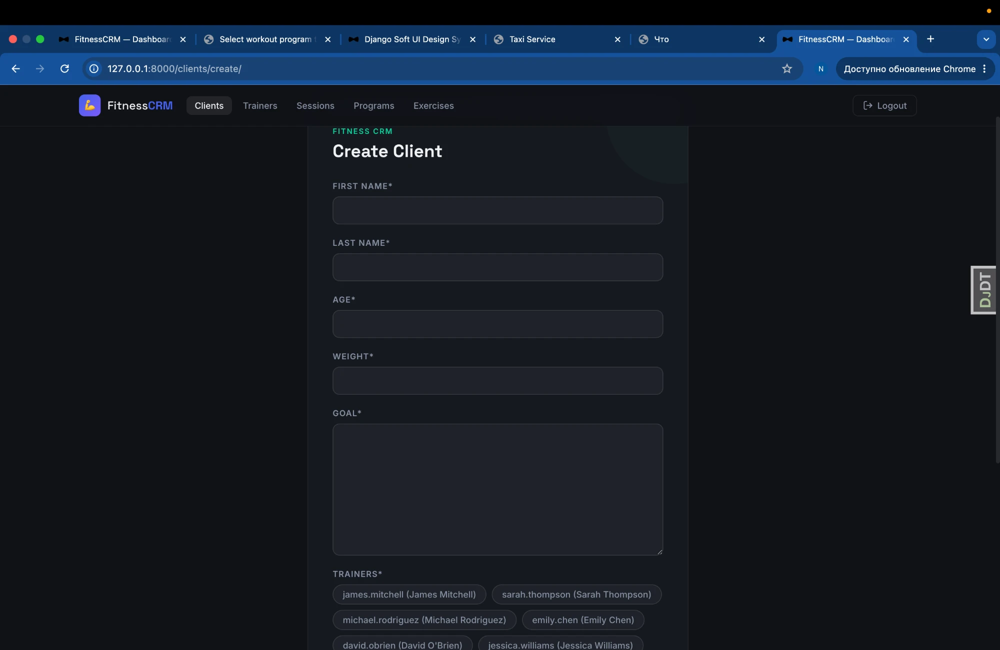

# Fitness CRM

A Django-based CRM system for managing a fitness studio: trainers, clients,
exercises, workout programs and training sessions.

## Problem this project solves

Fitness centers often manage trainers, clients and workout schedules through
spreadsheets or paper. This CRM centralizes all that data — trainers can see
their clients, track workout sessions, manage programs and monitor client
progress in one place.

## Features

### Authentication

- Login / logout functionality using Django's built-in authentication.
- All pages are protected with `LoginRequiredMixin` — unauthorized users are
  redirected to the login page.

### Trainers

- List of all trainers with specializations, experience and client count.
- Trainer detail page showing profile info and the list of assigned clients.
- Create, update (experience years) and delete a trainer.
- Search by first name or last name.

### Clients

- List of all clients with goal, weight, age and assigned trainers.
- Client detail page showing completed workouts, upcoming workouts, assigned
  trainers and the last session.
- Create, update and delete a client.
- Search by first name or last name.

### Exercises

- List of all exercises with muscle groups and descriptions.
- Exercise detail page.
- Create, update and delete an exercise.
- Search by name or muscle group.

### Workout programs

- List of programs with workout type, exercise count and session count.
- Program detail page showing the full description, exercises and recent
  sessions.
- Create, update and delete a program.
- Search by name.

### Workout sessions

- List of sessions with date, trainer, capacity and status.
- Session detail page showing participants, trainer and duration.
- Create, update and delete a session.
- Filter by date.

### Create / Update / Delete

- CRUD is implemented for all entities: Trainers, Clients, Exercises, Workout
  Programs and Workout Sessions.
- All forms are validated on the server side.
- After successful creation the user is redirected to the detail page.
- After deletion the user is redirected to the list page.

### Performance optimizations

- `select_related` and `prefetch_related` on all list and detail views to
  eliminate N+1 queries.
- `annotate` used in `ClientListView` and `ClientDetailView` for
  completed/upcoming workout counts.
- Admin querysets optimized with `prefetch_related`.

### Front-end

- Custom dark-themed UI built from scratch with CSS variables.
- All styles extracted to `static/css/crm.css`.
- Responsive navigation with active page highlighting.
- Custom form styling with crispy forms.

## Models

| Model            | Description                                                        |
|------------------|--------------------------------------------------------------------|
| `Trainer`        | Custom user model with specializations and experience.             |
| `Client`         | A studio client with goal, age, weight and assigned trainers.      |
| `Exercise`       | A single exercise with a muscle group and description.             |
| `WorkoutProgram` | A named program built from exercises with a workout type.          |
| `WorkoutSession` | A scheduled session linking clients, a trainer and a program.      |
| `Specialization` | A trainer specialization.                                          |
| `WorkoutType`    | A type/category of a workout program.                              |

## Requirements

- Python 3.13+
- See [requirements.txt](requirements.txt) for the full list of dependencies.

## Installation

```bash
# Clone the repository
git clone <your-repo-url>
cd py-fitness-crm

# Create and activate a virtual environment
python -m venv .venv
source .venv/bin/activate   # on Windows: .venv\Scripts\activate

# Install dependencies
pip install -r requirements.txt

# Apply migrations
python manage.py migrate

# Create a superuser (optional, for admin access)
python manage.py createsuperuser

# Run the development server
python manage.py runserver
```

The site will be available at http://127.0.0.1:8000/.

## Usage

- Open http://127.0.0.1:8000/ to access the application.
- Use http://127.0.0.1:8000/admin/ to manage data via the Django admin.

## Screenshots

### Login



### Home



### Trainers





### Clients



### Workout programs



### Exercises



### Workout sessions



### Create form


